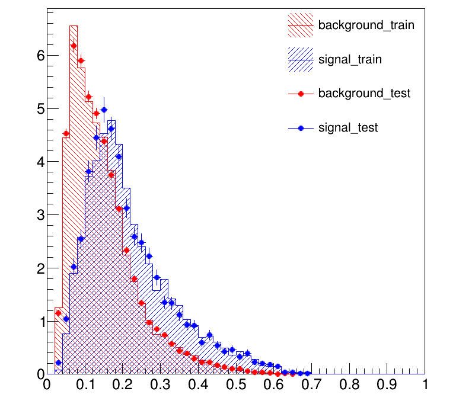

# Stock_Prediction_FBDT_Model

## Background & Motivation
This repository contains an end-to-end quantitative finance machine learning pipeline. It was originally developed to explore how the rigorous, petabyte-scale data analysis frameworks used in High-Energy Physics (HEP) can be applied to financial market prediction. 

## Key Features

*   **Languages:** C++, Python, Bash
*   **Machine Learning:** FastBDT (C++ Boosted Decision Trees), Grid Search Hyperparameter Tuning
*   **Data Engineering:** FMP API, Pandas
*   **Statistical Evaluation:** CERN ROOT (`TH1D`, `TTree`, `TCanvas`), Scikit-learn, Seaborn
*   **Infrastructure:** LSF Cluster Computing (`bsub`) for distributed model training

## Pipeline

### 1. Data Ingestion (`downloader.py`)
*   Asynchronously fetches historical financial data (Income Statements, Balance Sheets, Cash Flow) for thousands of NASDAQ/NYSE equities via API.
*   Ingests macroeconomic indicators (CPI, Federal Funds Rate, 30-Year Mortgage Rate) to act as macro-regime features.

### 2. Feature Engineering & Preprocessing (`preprocess.py` & `SetMaker.py`)
*   Calculates 60+ stationary financial ratios (e.g., `revenue/marketCap`, `EBITDA/marketCap`).
*   Computes chronological rate-of-change (deltas) for fundamental features to capture momentum.
*   **Data Sanitization:** Automatically handles infinities, normalizes extreme outliers, and strictly drops anomalous inputs.
*   Chronologically splits the data into Train, Test, and Out-Of-Sample (Application) sets to prevent data leakage.

### 3. Exploratory Data Analysis (`MakePlot.py`)
*   Generates automated normalized distribution histograms for all features.
*   Computes and visualizes massive correlation matrices to evaluate multicollinearity among the engineered features.

### 4. Distributed Grid Search & Model Training (`GridSearch.cc` & `submit.sh`)
*   A bash-scripted pipeline (`submit.sh`) deploys thousands of parallel FastBDT training jobs to an LSF compute cluster (`bsub`).
*   Tests across combinations of `nTrees`, `depth`, `shrinkage`, `subsample`, and `binning`.
*   Outputs Train vs. Test AUC (Area Under Curve) to rigorously isolate the optimal hyperparameters without overfitting.

### 5. Application & Inference (`ApplicationFBDT.cc`)
*   Applies the trained C++ FastBDT weights (`.weightfile`) to out-of-sample application data.
*   Uses the CERN ROOT framework to plot continuous signal vs. background (price up vs. price down) probability distributions.

---

## Results & Visualizations

### Model Evaluation (Train vs. Test)
The plot below visualizes the FastBDT probability output for both Signal (price up) and Background (otherwise). The solid histograms represent the training data, while the scatter points represent the unseen testing data. 
<p align="center">
  
</p>

---

## How to Run

**1. Set Your API Key**

Check `downloader.py`

**2. Execute the Data Pipeline**
```bash
python downloader.py
python preprocess.py
python SetMaker.py
```

**3. Compile and Run the C++ Grid Search**
```bash
# Submit jobs to the LSF cluster
./submit.sh
```

**4. Evaluate Results**
```bash
ReadGridSearchFile
ApplicationFBDT
```
